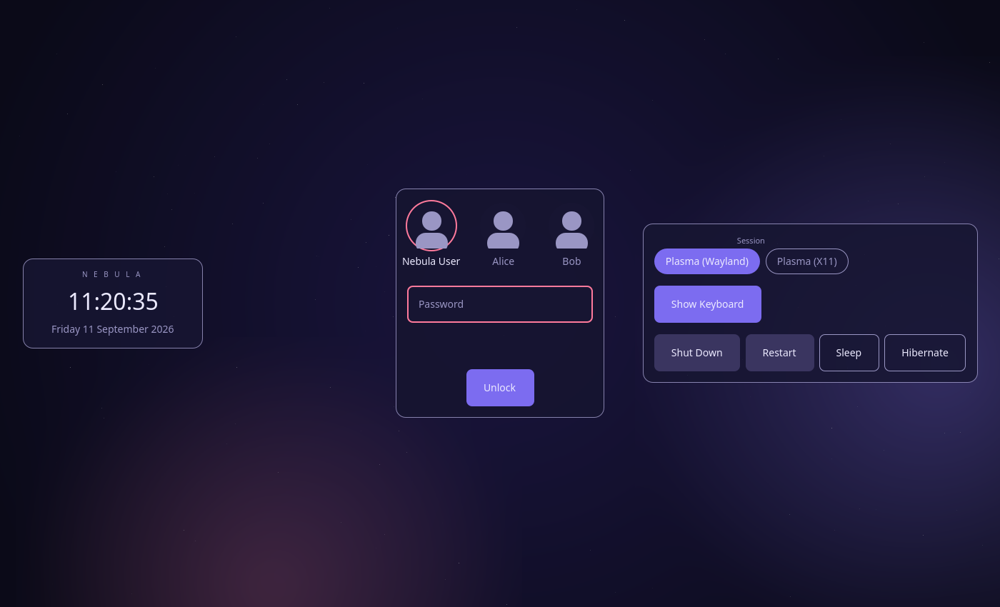
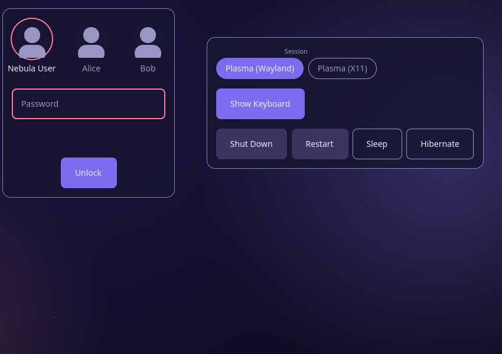
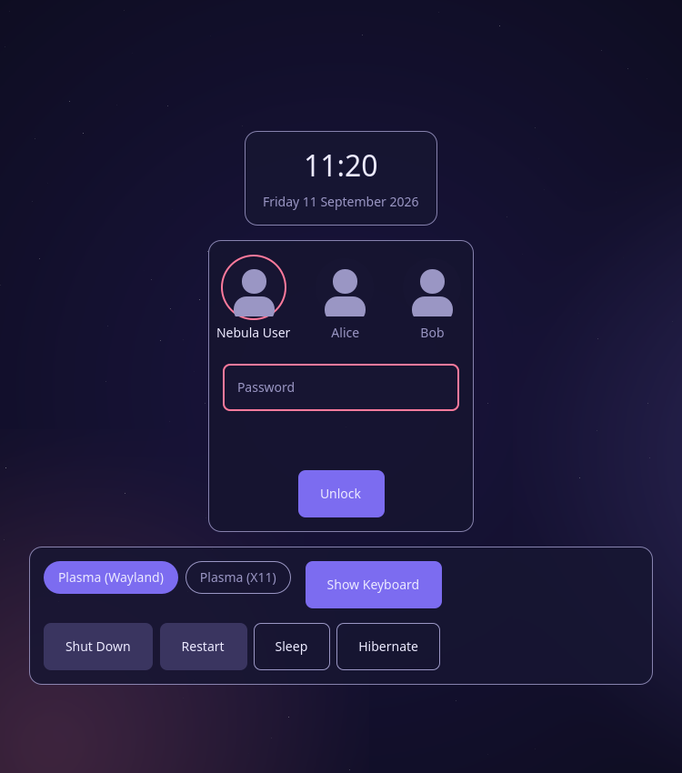

# Dashboard (Experimental)

**Experimental — not an official theme yet.** A real daily-use experiment,
not a finished product: validating whether a left (context) / center
(authentication) / right (controls) triptych composition earns its
place over repeated real logins, built entirely on [`core/`](../../core/)
with no modification to it. See
[`../../docs/Dashboard-Theme-Report.md`](../../docs/Dashboard-Theme-Report.md)
for the full validation write-up and
[`../../docs/Dashboard-Usability-Log.md`](../../docs/Dashboard-Usability-Log.md)
for the ongoing daily-use log. Evolved from the architecture stress test
that first proved this composition possible without any Core change —
see [`../../docs/Dashboard-Architecture-Stress-Test.md`](../../docs/Dashboard-Architecture-Stress-Test.md).

## Layout

| Region | Content |
|---|---|
| **Left — Context** | Clock, date, a small theme wordmark |
| **Center — Authentication** | Avatar/user selection, password, Unlock, error/busy status |
| **Right — Controls** | Session selector, virtual-keyboard toggle, power actions |

`NebulaLoginLayout` is deliberately not used — its zones are hard-capped
to a single centered column by Core contract, unsuited to three
simultaneous regions. The root layout is hand-assembled from
`NebulaBackground` + `NebulaSurface` + the interactive components, every
one of them used exclusively through its documented public API (see
`Dashboard-Architecture-Stress-Test.md`, Gap 1).

Nothing here is mocked: unlike the earlier stress-test prototype (static
"Host/Battery/Network" placeholder text), every element on screen is
wired to a real Core Service. If a Service reports nothing available
(e.g. the real `SDDMPowerAdapter`'s skeleton `can*` flags, all `false`
under real SDDM today), the corresponding control simply doesn't render
— never a dead placeholder.

## Responsive behavior

Three width tiers, theme-local properties (`wideBreakpoint: 1200`,
`mediumBreakpoint: 900`), not `theme.conf` keys — see
`Dashboard-Architecture-Stress-Test.md` Gap 2:

- **Wide** (≥1200px): full triptych, side panels at the stage edges.
- **Medium** (900–1199px): the left context panel stays beside the card
  (it always fits); session/keyboard/power fold into one wrapping block
  below the card instead — real measurement showed
  `NebulaPowerButtons`' own un-wrappable 4-button row never fits beside
  the card at any medium width (see the Theme Report's Core-gap note).
- **Narrow** (<900px): the same fallback as medium, both panels folded
  above/below the centered auth card — controls stay reachable, per the
  brief's own small-screen strategy, rather than simply hidden.

## Identity

Cosmic indigo/violet — deliberately distinct from Nord (blue/sober) and
Glass (frosted neutral), leaning into the project's own name for its
GitHub showcase role. No GPU blur/shader (Core has none, see
`../../docs/Rendering-Guidelines.md`); depth comes from
`surfaceOpacity`/`overlayOpacity` plus the wallpaper alone, same approach
as Glass. `theme.conf` overrides 17 tokens: 9 colors, 2 radii, 3
surface/overlay, 1 animation duration, 2 fonts (Noto Sans, an existing
system-font dependency, see `../../docs/Third-Party-Licenses.md`).

Contrast measured (sRGB relative-luminance): the Unlock button's label
is 3.38:1 on its primary-color background — passes WCAG AA for large
text, not small text, matching Glass's own already-documented ~3.6:1
gap (`NebulaButton` always uses `textPrimary` regardless of `variant`,
a known Core limitation, not introduced here — see
`../../docs/Core-Refinement-Review.md`).

## Assets

- `assets/wallpapers/dashboard.png` (3840×2160) + `dashboard-compressed.jpg`
  — an original indigo/violet radial-gradient field with a sparse
  procedural starfield, generated for this project (ImageMagick). No
  external dependency, freely redistributable under this repository's
  license (GPLv3).
- `assets/icons/`, `assets/fonts/` — empty: `NebulaAvatar`'s built-in
  zero-asset fallback silhouette covers the current scope, and Noto Sans
  is a system font, never bundled.

## Known limitations (this phase)

- Real `SDDMSessionAdapter`/`SDDMPowerAdapter`/`SDDMUserAdapter` are
  still Phase 1.4 skeletons under real SDDM (empty sessions, no power
  capability, empty user list beyond the logged-in account) — a
  pre-existing, already-documented limitation, not introduced by this
  theme. The right panel and its whole `NebulaSurface` correctly stay
  hidden when nothing is available, confirmed on real hardware.
- `NebulaKeyboardSelector` (real keyboard *layout* selection, as opposed
  to the on-screen virtual keyboard) is documented in `Core-API.md` but
  still never implemented — the right panel's "keyboard" control is only
  the virtual-keyboard show/hide toggle.
- `NebulaPowerButtons`' internal 4-button `Row` cannot wrap and has no
  compact/icon-only mode — at very narrow widths (roughly <600px, well
  below any realistic desktop/laptop display) all four buttons can still
  overflow the available width. A real, reusable Core gap — see the
  Theme Report for the smallest proposed fix. Not worked around further
  here (single-theme need, doesn't meet the API-freeze bar today).

## Options

`theme.conf` overrides 17 tokens (see Identity above). Panel visibility
and the two responsive breakpoints are plain QML properties in
`Main.qml`, not `theme.conf` keys — see
`Dashboard-Architecture-Stress-Test.md` Gap 2 for why.
